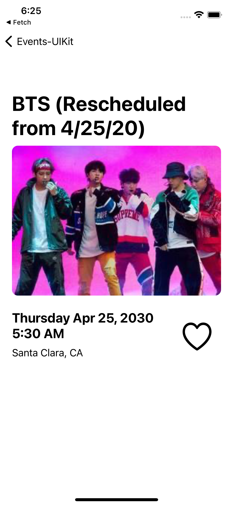

# Fetch-UIKit (UIKit Version of original app)

Displays events from the SeatGeek API (https://platform.seatgeek.com/)

## Original SwiftUI App
### This is a remake of the app linked below. 
[SwiftUI App Link](https://github.com/Andylochan/Fetch/)

## Differences
- Remove dependency for SwiftyJSON/Alamofire
- Using Decodable to parse JSON reponse 
- Using UIKit instead of SwiftUI

## How to use
Please open and run the ```Fetch-UIKit.xcworkspace``` file to view the project. 

## App Screenshots

 |  | 

## Dependency Manager

[Cocoapods](https://cocoapods.org/)
